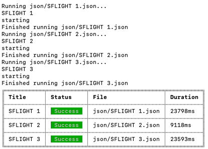

# Replay UI Tests

This is a sample app to show how replay can be used to automatically run UI tests for testing a web app. More information about the approach and app created as an example can be found at the my blog post [Replay UI tests]().

The recommended approach for going through the example is to read first the blog post and create the app in parallel by following the steps outlined in the blog post. This repository should be used as reference and help.

## Step 5: Run all tests

Add the custom extension to the npm test script in package.json

```json
"test": "replay --ext extension.js json"
```

Run all tests in folder json by running npm test.

```sh
npm test
```

All tests in the folder JSON should be executed successfully.

Test report:

