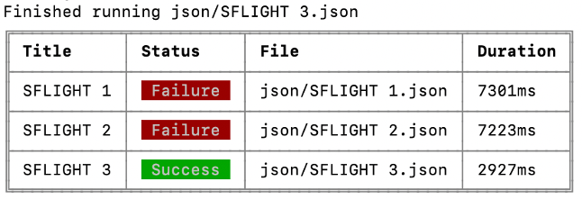
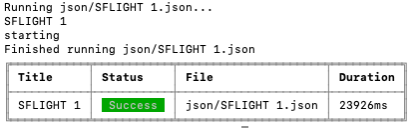

# Replay UI Tests

This is a sample app to show how replay can be used to automatically run UI tests for testing a web app. More information about the approach and app created as an example can be found at the my blog post [Replay UI tests]().

The recommended approach for going through the example is to read first the blog post and create the app in parallel by following the steps outlined in the blog post. This repository should be used as reference and help.

## Step 4: Solve timeout problem

Run the tests

```sh
npm test
```

The result is an error. Not all tests are run successfully.



Running test SFLIGHT 1.json in replay with Chrome attached (parameter --headless 0) shows that the page is loaded, but no interaction is done on the UI controls.

```sh
npx replay --headless 0 json/SFLIGHT\ 1.json
```

Result in Chrome


Adding a timeout to the replay test step execution by providing a custom extension will make replay wait for 2 seconds before peforming a click action on any HTML element.

File: extension.js

Timeout method:

```javascript
async beforeEachStep(step, flow) {
      await super.beforeEachStep(step, flow);
      // timeout. Wait for 2 seconds so UI5 loads and the elements are loaded and clickable
      await new Promise(r => setTimeout(r, 2000));
    }
```

Change module type in package.json to module:

```json
"type": "module",
```

Run replay with the custom extension:

```sh
npx replay --headless 0 --ext extension.js json/SFLIGHT\ 1.json
```

Result: test will run successfully.



Video:

